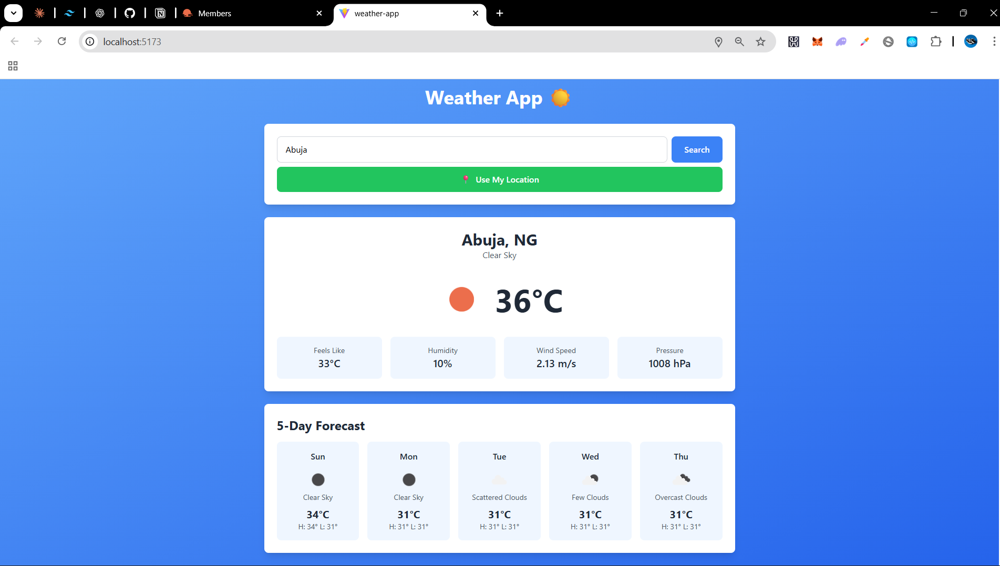

# 🌤️ Weather App

A modern, fully functional weather application built with React that provides current weather conditions and 5-day forecasts for any city worldwide.

## ✨ Features

- **City Search**: Search weather by city name
- **Current Weather**: Real-time temperature, humidity, wind speed, and atmospheric pressure
- **5-Day Forecast**: Extended weather predictions with high/low temperatures
- **Geolocation**: Auto-detect and display weather for your current location
- **Weather Icons**: Visual weather condition indicators
- **Responsive Design**: Seamless experience across all devices
- **Error Handling**: User-friendly error messages
- **Loading States**: Visual feedback during data fetching

## 🛠️ Built With

- **React** - UI library
- **Vite** - Build tool
- **Tailwind CSS** - Styling
- **OpenWeatherMap API** - Weather data
- **Geolocation API** - Location detection

## 🚀 Live Demo

[View Live Demo](YOUR_VERCEL_URL_HERE)

## 📸 Screenshots



## 💻 Installation

1. Clone the repository

```bash
git clone https://github.com/NiyiCodes0/weather-app.git
cd weather-app
```

2. Install dependencies

```bash
npm install
```

3. Create `.env` file and add your OpenWeatherMap API key

```
VITE_WEATHER_API_KEY=your_api_key_here
```

4. Run the development server

```bash
npm run dev
```

## 🎯 What I Learned

- Fetching data from REST APIs with async/await
- Managing multiple API calls simultaneously
- Implementing browser Geolocation API
- Handling loading and error states in React
- Working with environment variables
- Parsing and formatting API response data
- Creating responsive grid layouts with Tailwind

## 📝 API Used

This project uses the [OpenWeatherMap API](https://openweathermap.org/api):

- Current Weather Data API
- 5 Day / 3 Hour Forecast API

## 🔗 Connect With Me

- Twitter: [@Adeniyi_Morak](https://twitter.com/Adeniyi_Morak)
- LinkedIn: [adeniyidev](https://www.linkedin.com/in/adeniyidev/)
- GitHub: [@NiyiCodes0](https://github.com/NiyiCodes0)

---

⭐ If you found this helpful, please consider giving it a star!

```

---

### **Step 2: Add .env to .gitignore**

**IMPORTANT:** Don't push your API key to GitHub!

Open `.gitignore` file and make sure it includes:
```

.env
